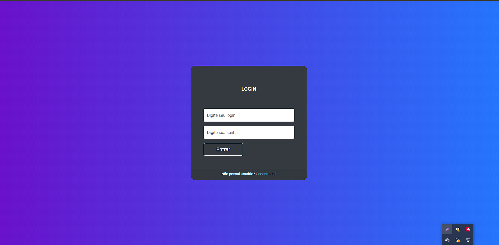
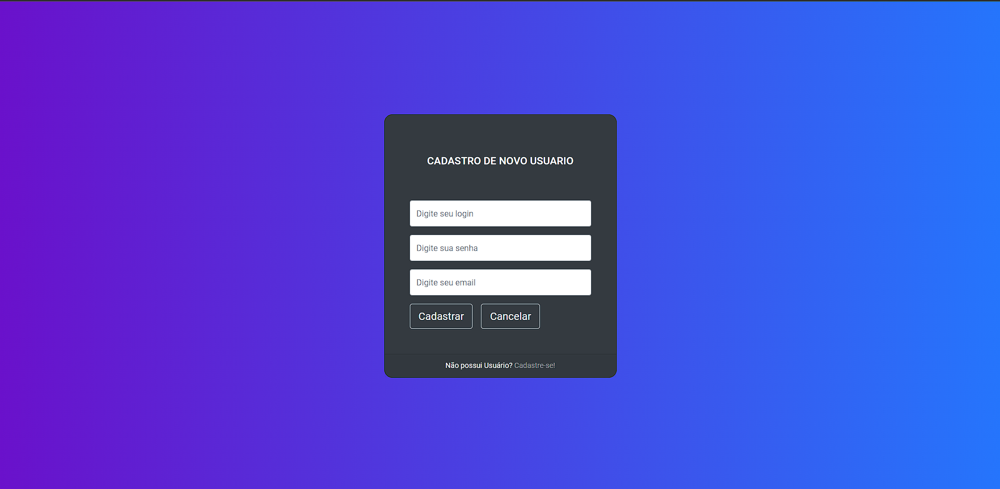
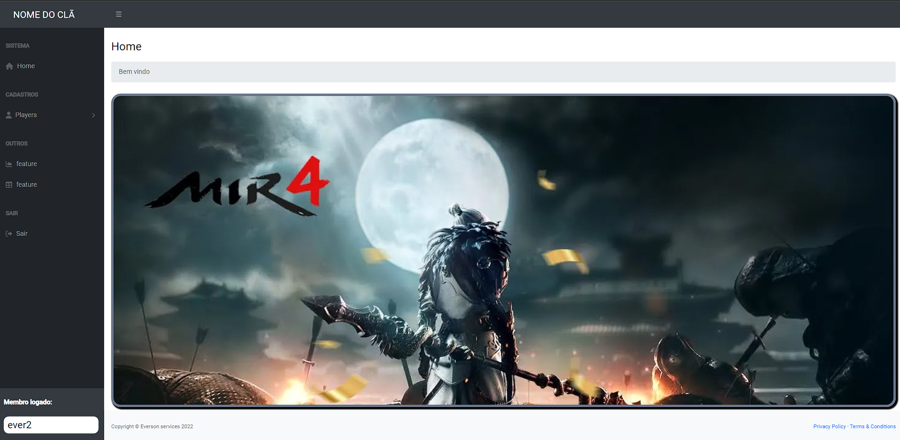
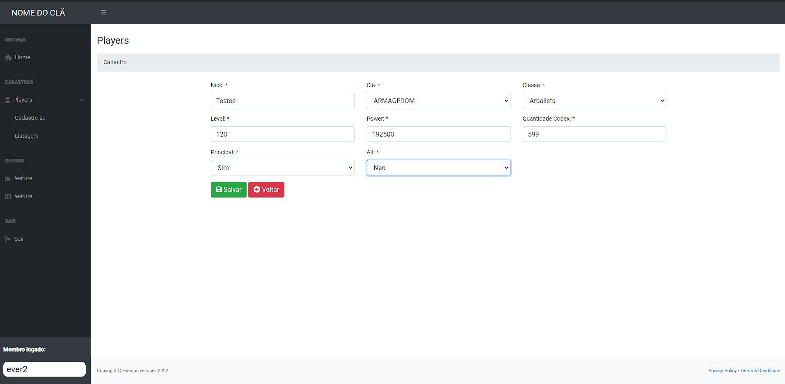
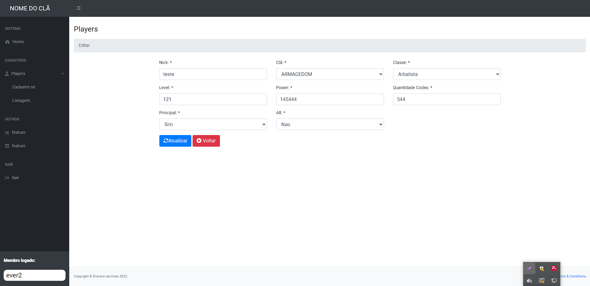
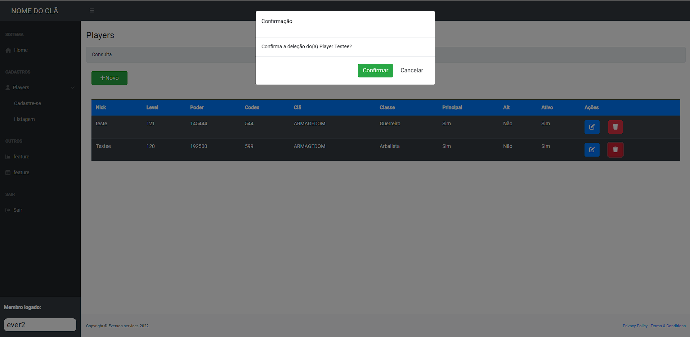
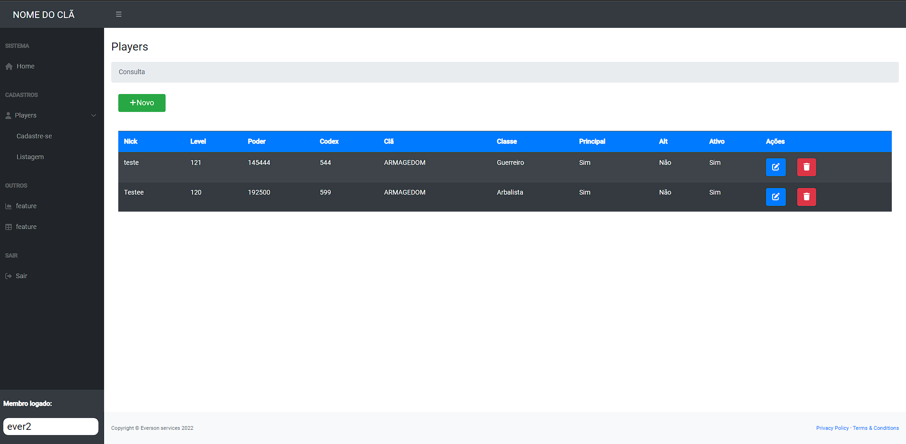
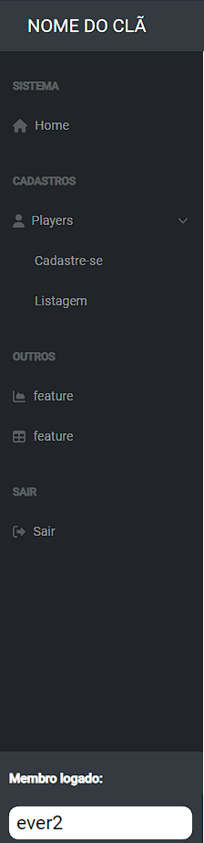
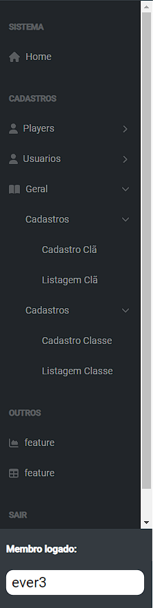

# GamerApp

## Requisitos
<ul>
<li> [Angular CLI](https://github.com/angular/angular-cli) versão 14.2.3. </li>
                      <h4>Biblioteca externa utilizada </h4>
<li> Bootstrap versão 4.3.1 </li>
<li> JQuery versão 3.6.1 </li>
</ul>

## Rodando a aplicação

<ul>
<li> Após realizar o clone do projeto execute o comando `npm install` para baixar as depêndecias do package.json  </li>
<li> Execute `ng serve` . Navegue até a url: `http://localhost:4200/`. É uma aplicação com reload automatico caso efetue alguma modificação nas pastas. </li>
</ul>

## Imagens do projeto

<h4> Login: </h4>

<h4> Cadastro Usuario: </h4>

<h4> Home: </h4>

<h4> Cadastro Player: </h4>

<h4> Edição Player: </h4>

<h4> Exclusão Player: </h4>

<h4> Listagem Player: </h4>

<h4> Menu Usuario: </h4>

<h4> Menu Admin: </h4>

## Observações

<ul>
<li> Para alterar a url de apontamento da aplicação back-end, você encontra na pasta `environments` o arquivo `environments.ts a apiURLBase`. </li>
<li> Assim como se preciso realizar a troca também do client-id e client-secret que foram criados na api do back-end </li>
</ul>
